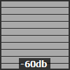
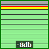
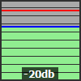
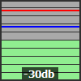
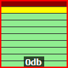
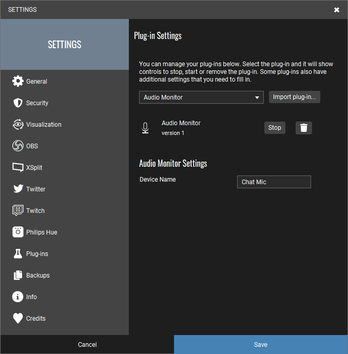

# Version 1

This plugin can be used to monitor your Audio Input Device in TouchPortal.
This plugin is in a **early stage**, and are still under testing.

Right now we only support Input devices like Microphones. 
The monitor is made to be similar to what you see on the GoXLR Fader Meter, and the Audacity monitor.

### Event edit

1. "When Plug-in State changes" 
> Choose "Audio Monitor Current Image Stream" and "does not change to"
2. "Change visuals by plug-in state" 
> Change to "Icon" and state to "Audio Monitor Current Image Stream" 
3. (optional) "Change Button Visuals" 
> Check "Change title to", and save.

**Important**: `Audio Monitor Current Device Name` should not be used here.
> This state is only updated on source switching (and the image will not be updated).

### Actions

* Toggle Monitoring: Pause / Resume monitoring
* Clear Minitopring: Clear the red and blue line.
* Next Audio Source: Change audio source to the next availible.
* Prev Audio Source: Change audio source to the prev availible.
* Reset Audio Source to Settings: Clears next/prev selection, and uses the default (or the one specified in settings) instead.

### States

* Audio Monitor Current Image Stream: The image that shows the actual monitor.
* Audio Monitor Current Device Name: A text showing the name of the currently selected device.

### Settings edit:

#### Device Name

* If empty: picks the default Windows Input device.
* If not empty: picks the first found Input device with a name containing this text.
* If no match: Nothing is selected, and the image will say "no device"

### The monitor

* Background: Green, then orange (from -12db) and red (-from -6db).
* Red line: is the max db that has been recordet after starting to monitor a source. 
* Blue line: is the max monitored the last 3 seconds. 
* Dark border: You are under -12db. 
* Green border: You are in that -6db to -12db range. 
* Red border: You are now over -6db.
