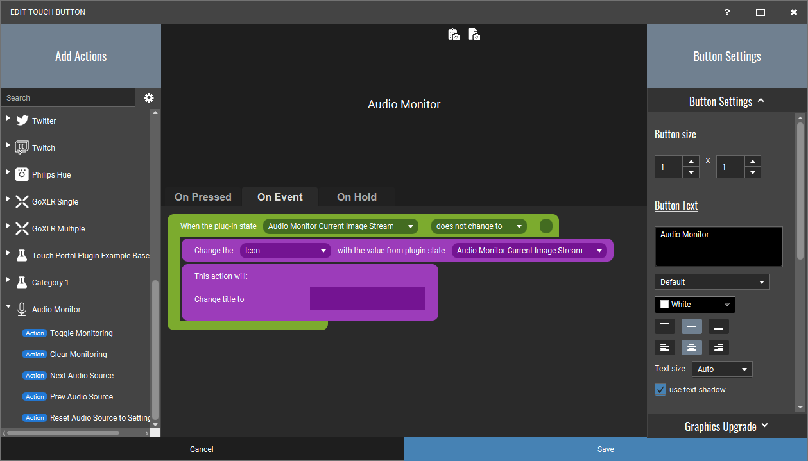

# WIP: TouchPortal.Plugin.AudioMonitor
Audio Monitor Plugin for Touch Portal 2.3+ Windows.

Download and install .tpp file from v2 beta [Pre-Release](https://github.com/oddbear/TouchPortal.Plugin.AudioMonitor/releases/tag/v2-build-004). <br />
**Important:** Some times you need to **refresh** the device page to "Kickstart" the updates.

[Latest Release](https://github.com/oddbear/TouchPortal.Plugin.AudioMonitor/releases/tag/v1) supports:
* Configure colors (ex. background to black)
* Configure from square to rectangle ex. 1x2, 1x3, 1x4 etc.

Feedback is welcome.

This plugin can be used to monitor your Audio Devices in TouchPortal.
This plugin is in a **early stage**, and are still under testing.


### Event edit

1. "When Plug-in State changes"<br />
> Choose "Audio Monitor Current Image Stream" and "does not change to"
2. "Change visuals by plug-in state"<br />
> Change to "Icon" and state to "Audio Monitor Current Image Stream"<br />
3. (optional) "Change Button Visuals"<br />
> Check "Change title to", and save.



**Important**: `Audio Monitor Current Device Name` should not be used here.
> This state is only updated on source switching (and the image will not be updated).

### Actions

* Toggle Monitoring: Pause / Resume monitoring
* Clear Minitopring: Clear the red and blue line.

### States

* Audio Monitor Current Image Stream: The image that shows the actual monitor.

### Settings edit:

#### Device Setup

To setup devices, you will need to modify the section Devices. You can add more than one device.

```json
{
  "Capture": {
    "Devices": [{
      "Name": "Chat Mic",
      "Direction": "Input",
      "Scale": "Logarithmic",
      "Label": "Some alias to show"
    },{
      "Name": "Device 2",
      "Direction": "Output",
      "Scale": "Linear",
      "Label": "Some alias 2"
    }]
  }
}
```

### The monitor

* Background: Green, then orange (from -12db) and red (-from -6db).
* Red line: is the max db that has been recordet after starting to monitor a source.<br />
* Blue line: is the max monitored the last 3 seconds.<br />

### Dependencies

- [NAudio.Wasapi](https://github.com/naudio/NAudio)
- [TouchPortalSDK](https://github.com/oddbear/TouchPortalSDK)
