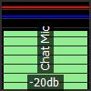
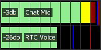
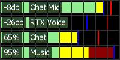

# TouchPortal.Plugin.AudioMonitor

## Introduction

Audio Monitor Plugin for Touch Portal (Windows only).

The idea of this plugin came when the GoXLR App was updated with the possibility to have mic toggle on the `cough` button.<br />
While this was a welcoming change, I did use the `Chat Mic` fader also for the `lighting:fader:mixer:style:Meter` functionality.

I wanted this functionality `off screen` so it wouldn't be hidden by fullscreen application. Since I already have Touch Portal running all the time, this was a natural choice.

There are some limitations though because of this using Touch Portal. One is latency, but this is not a big issue for me, another one is that anything other than square graphics are not really supported by Touch Portal. Well, it seems to work ok at the time of this writing (TP v2.3.010). However it will need a **page refresh** when changed _(tested on Android and iOS)_.

All feedback on this plugin is welcome.

## Download

The latest plugin _(v2)_ is now in pre-release, and should be quite stable. For the stable v1 plugin, se bottom of this page.

Download and install .tpp file from v2 beta **[Pre-Release](https://github.com/oddbear/TouchPortal.Plugin.AudioMonitor/releases/download/v2-build-006/TouchPortal.Plugin.AudioMonitor.Plugin.tpp)**.

**Important:** Some times you need to **refresh** the device page to "Kickstart" the updates.

## How it works

This plugin can be used to monitor your Audio Devices in TouchPortal.

There are several things that can be changed through configuration. Ex. colors, scale type, sizes, text toggle text, update interval, source renames etc.

| "Default" setup | Two inputs setup |
|-----|----|
|  |  |

As you can see on these pictures, there monitor itself has 3 colors, and two bars.

Colors:
* Light green: The volume is less than -12db _(0%-25%)_
* Yellow: The volume is between -12db and -6db _(25%-50%)_
* Dark red: The volume is higher than -6db _(50%-100%)_

Bars:
* Red: The highest measurement at any time after the plugin was started.
* Blue: The highest measurement the last 3 seconds.

The default scale is Logarithmic (-60db - 0db), but it is possible to change to Linear (0% - 100%) through configuration.

## Setup

To make the meter actually update, you will need to setup the On Event page in Touch Portal.<br />
Alternatively you can download and import the [TouchPortal.Plugin.AudioMonitor.Button.tpb
](https://github.com/oddbear/TouchPortal.Plugin.AudioMonitor/releases/download/v2-build-006/TouchPortal.Plugin.AudioMonitor.Button.tpb) file.

### Event edit

1. "When Plug-in State changes"<br />
> Choose "Audio Monitor Current Image Stream" and "does not change to"
2. "Change visuals by plug-in state"<br />
> Change to "Icon" and state to "Audio Monitor Current Image Stream"<br />
3. (optional) "Change Button Visuals"<br />
> Check "Change title to", and save.


### Actions

There are two actions, you might want to add one of them to the monitor button:

* Toggle Monitoring: Pause / Resume monitoring
* Clear Monitoring: Clear the red and blue line.

### States

* Audio Monitor Current Image Stream: The image that shows the actual monitor.

## Configuration

### Device Setup

This plugin is quite flexible in terms of configuration, but this is not a standard Touch Portal way of doing things, and can be a little overwhelming.

The configuration can be found on your local disk after installation of the plugin at:  `%appdata%\TouchPortal\plugins\TouchPortal.Plugin.AudioMonitor\appsettings.json`

When changing values, the updates should happen live on the screen in Touch Portal. If something seems wrong, please press the update button in Touch Portal on your device. If this does not help, there might be something wrong in the format.

The configuration is in JSON format, and if your not familiar with this it could be an idea to copy the content of the `appsettings.json` file into a page like [JSON Schema Validator
](https://www.jsonschemavalidator.net/s/9341jfJh), to get feedback if the changes are valid json.

The default file would look like this, underneath there will be an explanation of what this means.

```json
{
  "Logging": {
    "LogLevel": {
      "Default": "Information",
      "Microsoft": "Warning",
      "TouchPortalSDK" : "Warning" 
    }
  },
  "Capture": {
    "UpdateInterval": 150,
    "Devices": [
      {
        "Name": "default",
        "Direction": "Input",
        "Scale": "Logarithmic",
        "Label": "(.+).*\\(",
        "Levels": true
      }
    ]
  },
  "BarMeter": {
    "Width": 100,
    "Height": 100,
    
    "Debug": false,
    
    "Background": "Transparent",
    "Overlay": "#FF303030",

    "PeakHold": "Blue",
    "PeakMax": "Red",

    "Low": "LightGreen",
    "Mid": "Yellow",
    "High": "DarkRed"
  }
}
```

### Logging

Just ignore this section. ;)

### Capture

In the capture section there is a update interval, and a device list. The device list can be used to add multiple source _(see more underneath)_, and configure these.

The `UpdateInterval` is a whole number _(like 100 or 200, not decimals or text)_ of milliseconds, and can could be increased if the device cannot process the updates this fast. If you increase the size with width or height, it could be an idea to increase this value. Ex. 200x400 could use 300 as a UpdateInterval number. On 100x100, 150 is usually fine.

Device:

There are 5 options you can change here:

* "Name": Text
> default means default input or output device. <br />
> Any other text means try to match source with the device name. Ex. if the device is the "Microphone (NVIDIA Broadcast)" You can match it with just "Microphone", "NVIDIA Broadcast", or anything that the source name contains.<br />
> If not text is set or any match is found, then the meter will be empty. If multiple is found, the first one will be selected.

* "Direction": Text
> Can be set to either `"Input"` or `"Output"`. If not set, the default will be `"Input"`.

* "Scale": Text
> Can be set to either `"Logarithmic"` (db) or `"Linear"` (%). If not set, the default will be `"Logarithmic"`.

* "Label": Text
> This can be either set to a text of your choice, ex. RTX Voice. It does not need to match the Name.<br />
> You can also use Regex, where it would be the first group match. Ex. the default `"(.+).*\\("`, will in the text "Something (something)" mean, take everything until you find " (", and display as the label, then ignore the rest.

* "Levels": boolean
> Can be set to `true` or `false`

### BarMeter

This single section is used to set styling and size for the meter.

#### Width and Height
If the `Width` is greater than the `Height`, the meter will be horizontal. And if you change this, you will need to refresh the page on your Touch Portal device. It will only support whole numbers.

#### Debug

This `debug` a boolean that can be `true` or `false`. If true it will add the frame number in the center of the meter.<br />
This way you might see if any frames are dropped, or rendered in the wrong order.<br />
This usually means the `UpdateInterval` is to low, and needs to be increased (or image size/detail needs do be decreased).

#### Colors

The colors is text that will be parsed as HTML colors. You can use RGB hex values, ARGB hex values or Named colors:
* "#80FF0000": 50% transparent red.
* "#FF0000": solid red.
* "Red": solid red.

You can find all named colors in the [Microsoft docs](https://docs.microsoft.com/en-us/dotnet/api/system.windows.media.colors?view=netframework-4.7.2)

## Multiple Meeters

To add multiple meters, create more devices in the Devices array. This can be done by adding
`,{ "Name": "DeviceName" }` after `}` and before `]`.

An example could then look like:



```json
{
  "Logging": {
    "LogLevel": {
      "Default": "Information",
      "Microsoft": "Warning",
      "TouchPortalSDK" : "Warning" 
    }
  },
  "Capture": {
    "UpdateInterval": 300,
    "Devices": [{
        "Name": "Chat Mic (TC-Helicon GoXLR)",
        "Direction": "Input",
        "Scale": "Logarithmic",
        "Label": "(.+).*\\(",
        "Levels": true
      }, {
        "Name": "Microphone (NVIDIA Broadcast)",
        "Direction": "Input",
        "Scale": "Logarithmic",
        "Label": "RTX Voice",
        "Levels": true
      }, {
        "Name": "Chat (TC-Helicon GoXLR)",
        "Direction": "Output",
        "Scale": "Linear",
        "Label": "(.+).*\\(",
        "Levels": true
      }, {
        "Name": "Music (TC-Helicon GoXLR)",
        "Direction": "Output",
        "Scale": "Linear",
        "Label": "(.+).*\\(",
        "Levels": true
      }
    ]
  },
  "BarMeter": {
    "Width": 400,
    "Height": 200,
    
    "Debug": false,
    
    "Background": "Transparent",
    "Overlay": "#FF303030",

    "PeakHold": "Blue",
    "PeakMax": "Red",

    "Low": "LightGreen",
    "Mid": "Yellow",
    "High": "DarkRed"
  }
}
```

## Dependencies

- [NAudio.Wasapi](https://github.com/naudio/NAudio)
- [TouchPortalSDK](https://github.com/oddbear/TouchPortalSDK)

## V1 Plugin

Can be downloaded from: [Releases V1](https://github.com/oddbear/TouchPortal.Plugin.AudioMonitor/releases/tag/v1) supports [see v1 docs for more](https://github.com/oddbear/TouchPortal.Plugin.AudioMonitor/blob/master/Docs/v1.md).

This version is a lot simpler, but also only has support for a single square meter.<br />
With this version you cannot change colors, text or size.
