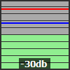

# WIP: TouchPortal.Plugin.AudioMonitor
Audio Monitor Plugin for Touch Portal 2.3+ Windows.

This plugin can be used to monitor your Audio Input Device in TouchPortal.
This plugin is in a **early stage**, and are still under testing.

Right now we only support Input devices like Microphones. 
The monitor is made to be similar to what you see on the GoXLR Fader Meter, and the Audacity monitor.

### Settings edit:

The plugin selects the input if it contains this text. If multiple inputs contains this text, the first one it finds will be selected.

### Event edit

1. "When Plug-in State changes" 
> Choose "Audio Device Monitor" and "does not change to"
2. "Change visuals by plug-in state" 
> Change to "Icon" and state to "Audio Device Monitor" 
3. (optional) "Change Button Visuals" 
> Check "Change title to", and save.
> 

### The monitor

* Background: Green, then orange (from -12db) and red (-from -6db).
* Red line: is the max db that has been recordet after starting to monitor a source. 
* Blue line: is the max monitored the last 3 seconds. 
* Dark border: You are under -12db. 
* Green border: You are in that -6db to -12db range. 
* Red border: You are now over -6db.

### Dependencies

- [NAudio.Wasapi](https://github.com/naudio/NAudio)
- [TouchPortalSDK](https://github.com/oddbear/TouchPortalSDK)
